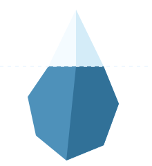

<p align="center">
  
</p>

# iceberg.sh

The copy-paste bridge between machines. Pipe **any bytes** — text, code, PDFs, images, SVGs, video — to a topic and grab them anywhere. No auth, no keys, no setup.

```sh
echo "hi from my laptop" | iceberg push notes   # one machine
iceberg pull notes                              # any other machine
```

## Install

```sh
curl -fsSL https://iceberg.sh/install.sh | sh
```

Or just use `curl` — there's nothing to install:

```sh
curl -d "hi" iceberg.sh/notes     # write
curl iceberg.sh/notes             # read
```

## CLI

```sh
iceberg topic <name>        # set a default topic (then push/pull need no name)
iceberg push [text]         # send text (or stdin) to a topic
iceberg pull [name]         # print a topic to stdout
iceberg open [name]         # open the topic's viewer in your browser
iceberg delete [name]       # clear a topic (asks first)

  -t, --topic <name>        # target a topic without making it the default
```

Examples:

```sh
iceberg topic notes               # set once
echo hi | iceberg push            # → notes
iceberg pull                      # → notes
iceberg push "quick note" -t scratch
iceberg push -t logo < logo.svg   # send a file (any bytes)
iceberg pull logo > logo.svg
```

## View in the browser

Open `iceberg.sh/v/<topic>` to view a topic. It renders **Markdown, text, images, SVG, PDFs, and video** — anything else offers a download. There's a QR button to hand the link to your phone.

## How it works

- A **topic** is any lowercase name (`a–z`, `0–9`, `-`). `POST` writes it, `GET` reads it.
- **Last write wins.** Topics expire after **10 minutes** and bodies are capped at **25 MiB**.
- No accounts, no encryption — the **topic name is the only thing guarding your data**, so pick something unguessable and **don't send anything sensitive.**

## Self-host

```sh
cd server && go run .     # listens on :5555
```

The CLI talks to `https://iceberg.sh` by default; point it elsewhere with `ICEBERG_SERVER`:

```sh
ICEBERG_SERVER=http://localhost:5555 iceberg pull notes
```

## License

MIT
